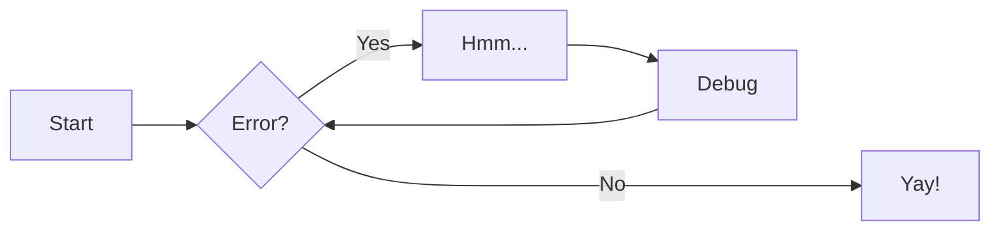
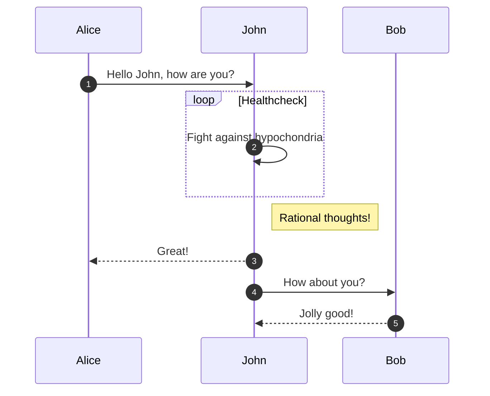
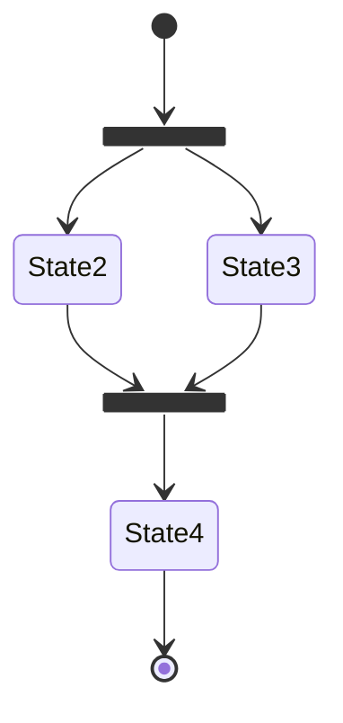
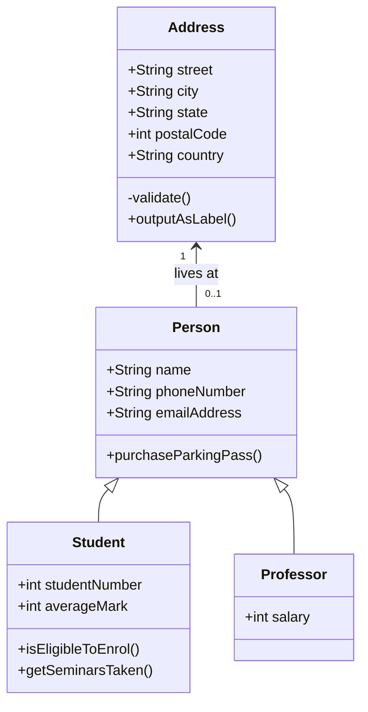
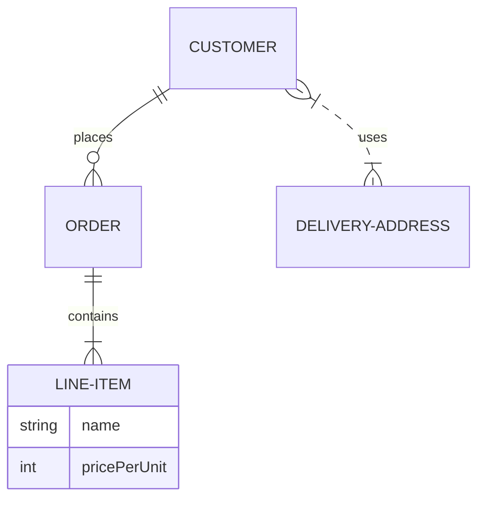
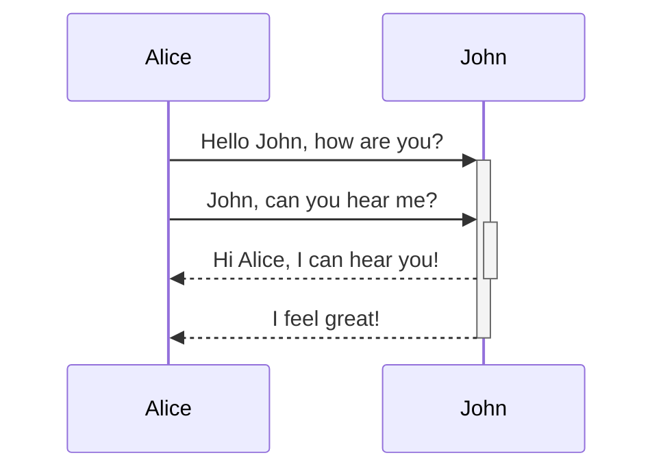

## Amazon Aurora DB clusters
An Amazon Aurora _DB cluster_ consists of one or more DB instances and a cluster volume that manages the data for those DB instances. An Aurora _cluster volume_ is a virtual database storage volume that spans multiple Availability Zones, with each Availability Zone having a copy of the DB cluster data. Two types of DB instances make up an Aurora DB cluster:

## Primary DB instance
 – Supports read and write operations, and performs all of the data modifications to the cluster volume. Each Aurora DB cluster has one primary DB instance.
    
## Aurora Replica
 – Connects to the same storage volume as the primary DB instance and supports only read operations. Each Aurora DB cluster can have up to 15 Aurora Replicas in addition to the primary DB instance. Maintain high availability by locating Aurora Replicas in separate Availability Zones. Aurora automatically fails over to an Aurora Replica in case the primary DB instance becomes unavailable. You can specify the failover priority for Aurora Replicas. Aurora Replicas can also offload read workloads from the primary DB instance.
    

The following diagram illustrates the relationship between the cluster volume, the primary DB instance, and Aurora Replicas in an Aurora DB cluster.


``` py
name = "John Doe"
age = 30
city = "San Francisco"

print("Name:", name)
print("Age:", age)
print("City:", city)
```












!!! note

    Lorem ipsum dolor sit amet, consectetur adipiscing elit. Nulla et euismod
    nulla. Curabitur feugiat, tortor non consequat finibus, justo purus auctor
    massa, nec semper lorem quam in massa.


!!! example

    === "Unordered List"

        ``` markdown
        * Sed sagittis eleifend rutrum
        * Donec vitae suscipit est
        * Nulla tempor lobortis orci
        ```

    === "Ordered List"

        ``` markdown
        1. Sed sagittis eleifend rutrum
        2. Donec vitae suscipit est
        3. Nulla tempor lobortis orci
        ```

:question::question::question::question:
find emoji from here
```
https://squidfunk.github.io/mkdocs-material/reference/icons-emojis/
```