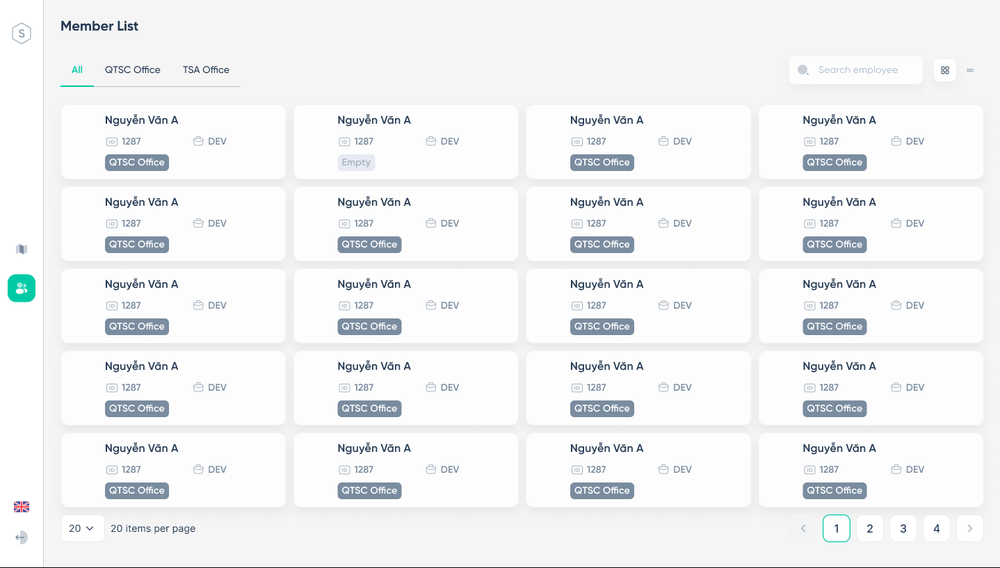
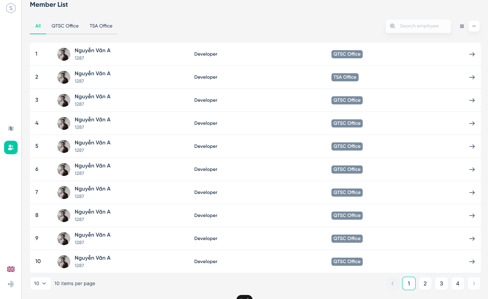

## Outline

 - Only managers can access this screen
 - Display member information
 - Link member to 2D seat chart
 - Search member

## Layout

### Layout 1

 - Display information of all members in card form

### Layout 2

 - Display information of all members in table form

## Requirement Definition

### Item Definition

| No. | Item Name               | Definition                                                                             |
| --- | ----------------------- | ---------------------------------------------------------------------------------------|
| 1   | ALL                     | Display information of all members                                                     |
| 2   | Office name             | Display information of all members in the corresponding office                         |
| 3   | Search                  | Search member                                                                          |
| 4   | Card form               | Display member in card form                                                            |
| 5   | Table form              | Display member in table form                                                           |
| 6   | Member card(card form)  | Link to 2d view                                                                        |
| 7   | Arrow button(table form)| Link to 2d view                                                                        |
| 8   | Paging                  | Select the number of members to display on 1 page (20/50/100)                          |

### Operation Description

1. Initial Display
     Display information of all member, table form , 20 member per page

2. Click on 【Office name】
    Display information of all members in the corresponding office

3. Click on 【Search】 icon
    Display the search bar, enter the member information want to find and press enter to search

4. Click on 【member card】 or 【arrow】 button
　　Move through the 2D view screen and displays the clicked member location

5. Click on 【Paging】
    Select the number of members to display per page (20/50/100)

