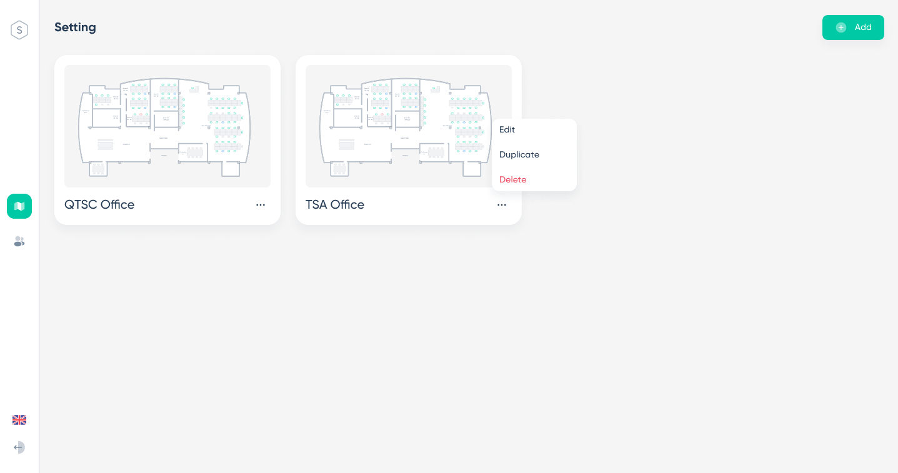

## Outline

### Common:
 - Displays the list of seat charts available in the system
 - Switch language
### Manager:
 - Edit/add/duplicate seat chart
 - Delete seat chart

## Layout

## Requirement Definition

### Item Definition

| No. | Item Name               | Definition                                                                             |
| --- | ----------------------- | ---------------------------------------------------------------------------------------|
| 1   | SeatChart name and icon | Click here to move to the corresponding 2d view screen                                 |
| 2   | ...Option               | Can select Edit , Duplicate , Delete seat chart                                        |
| 3   | Add                     | Select seat chart layout between QSTC Office and TSA office for new seat chart         |

### Operation Description

1. Initial Display
    Display the list of seat charts available in the system: name and image

2. Click on the 【seat chart image】
    Move to the corresponding 2d view page

3. Click on the 【Add】
    Select seat chart layout between QSTC Office and TSA office for new seat chart

4. Click on the 【QTSC Office】 or 【TSA Office】
    Move to seat chart management page with corresponding layout

5. Click on the 【…】
    Display 3 option edit/duplicate/delete

6. Click on the 【edit】
    Move to seat chart management page with corresponding seat chart

7. Click on 【Duplicate】
    Display confirm popup. Allow to choose duplicate or cancel the operation
    
8. Click 【Delete】
    Display confirm popup. Allow to choose duplicate or cancel the operation