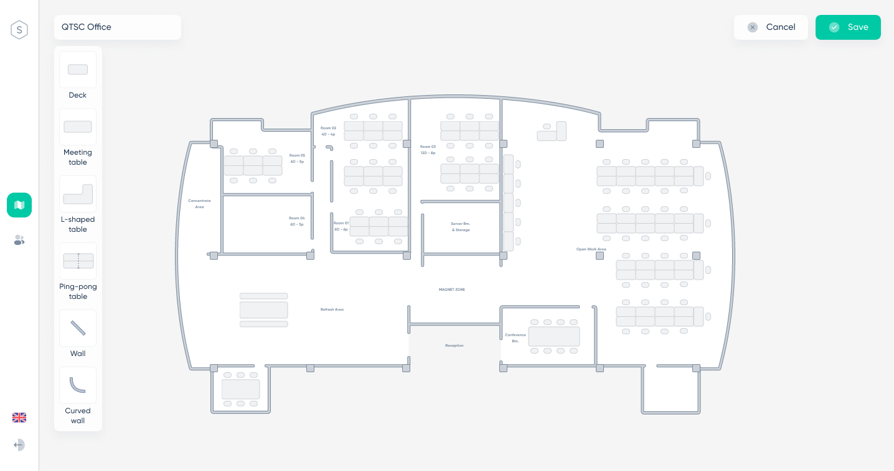
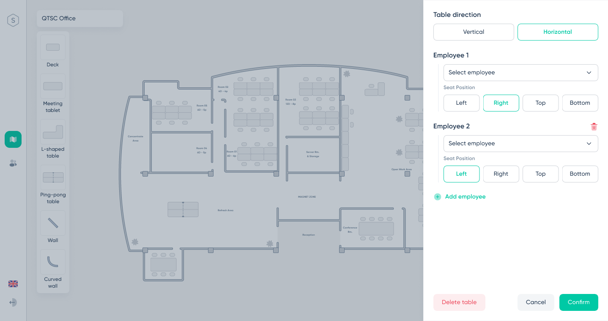

## Outline

 - Add/edit/delete model from seat chart
 - Arrange the position of tables and seat
 - Add member to the seat

## Layout

## Requirement Definition

### Item Definition

| No. | Item Name               | Definition                                                                             |
| --- | ----------------------- | ---------------------------------------------------------------------------------------|
| 1   | Office name             | Display office name, can rename                                                        |
| 2   | List model              | Display list model, can drag and drop model to chart                                   |
| 3   | Table                   | Click table to open table setting                                                      |
| 4   | Table setting           | Setting member position sitting on that table, table direction                         |

### Operation Description

1. Initial Display
     Display information of seat chart

2. Click on 【Model】 
    Drag and drop model to chart

3. Click on 【Table】 model 
     Display table setting form

4.【Table setting】
     . Choose the direction of the table
     . Choose employee
     . Add employee from table
     . Delete employee from table
     . Select seat position of employee